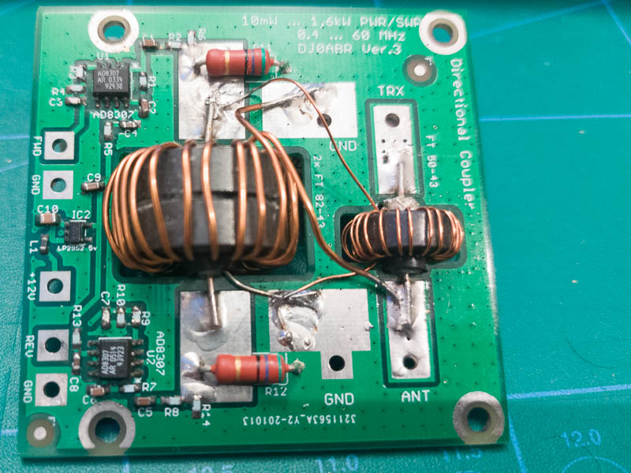

# QRO power and SWR meter

For my HF amateur radio station, this is a system aimed at 
measuring output power and whether there is a good match between
the radio and the antenna. 

## Sensor 

The sensor is the one designed by DJ0ABR, the [Power / SWR precision measuring coupler](https://projects.dj0abr.de/doku.php?id=en:pwrswr:schbrd), 
and it will live in a separate box that can be hidden behind the radio. This will be a simple
aluminium diecast box (a [Hammond 1590Y](https://www.hammfg.com/electronics/small-case/diecast/1590)).
DJ0ABR has GPL'ed his design, I suggest you go to his site to look at the design. It is a fairly standard dual
directional coupler [described by Alan, W2AEW](https://youtu.be/byF1FLdbUiA?si=D1dZQjEEJ_ZNabvi), but with
two AD8307 to measure the forward and the reflected power.

There will be three connectors to this box:

1. RF Radio-side (N-connector).
2. RF Antenna-side (N-connector).
3. Power supply and signal out (GX16, also known as the "Aviation connector") with four pins: 
   1. GND
   2. 12V
   3. Forward power voltage (AD8307 voltage out)
   4. Reflected power voltage (AD8307 voltage out)

## Controller and Display

At the controller side, I need a dual ADC to digitize the signals for forward
and reflected power, to display power and return loss to a display, and I want a
an ethernet adapter such that the meter can post how much power is transmitted
to a log on a database server.

